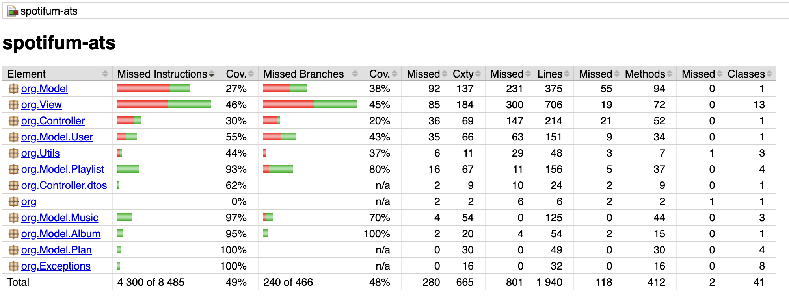
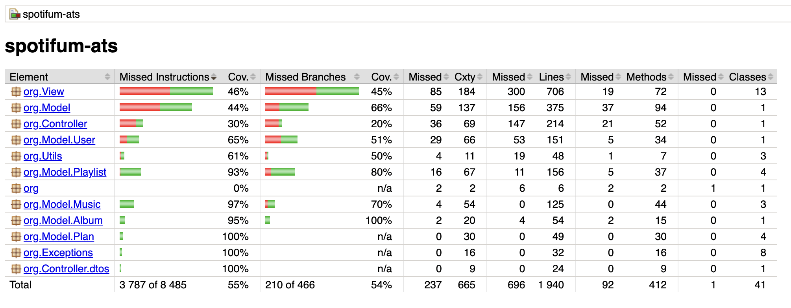

## Análise e Teste de Software - Trabalho Prático

**Projeto escolhido:** Projeto 1;

Inicio do projeto tinhamos 235 testes unitarios às varias classes, nesta fase apenas um teste falhava:

- **testHandleInputChangePlans:**
  - Expected: true
  - Actual: false
  - Explicação: bug do case 3 sem break
  - O switch-case cai para o case 4 por ausência de break, navegando para o PlanMenu

**ControllerTest**: Foi adicionado ainda antes de verificarmos a cobertura pois consideramos que seja um dos fluxos principais a exercitar testes. É então um conjunto de testes unitarios que validam o comportamento do controlador, confirmando que os metodos retornam os resultados esperados e que as regras de negócio e erros sao tratados corretamente.

**Testes na serialização**

Foram adicionados testes unitarios para o utilitario de serializacao, cobrindo o fluxo principal (round‑trip) e os cenarios de erro mais provaveis (null, ficheiro inexistente, caminho invalido).
O teste de round‑trip confirma que a serializacao preserva o estado observado por SpotifUM.equals.

### Cobertura de Testes - jacoco

Após análise da cobertura de testes atual do projeto decidimos focar as atenções em criar testes unitários para as seguintes classes:

**org.Controller.dtos.MusicInfo:**

MusicInfo é um Data Transfer Object (DTO) que transporta informação de uma música entre o Controller e a View durante a reprodução. Tinha 62% de cobertura de instrucções na baseline mas nenhum teste direto. Foram adicionados 14 testes que cobrem os dois construtores (o principal e o de erro) e o único setter da classe. O teste testConstrutorPrincipalLetraPartidaEmPalavras é particularmente relevante: verifica que o split da letra por espaços funciona correctamente, comportamento que a View depende para mostrar a letra palavra a palavra durante a reprodução.

**org.Utils.BrowserOpener e org.Utils.MusicPlayer:**

Estas duas classes apresentam um desafio comum em testes unitários: dependências de ambiente externo. O BrowserOpener depende da API java.awt.Desktop, que requer um ambiente gráfico (GUI). O MusicPlayer depende de ficheiros de áudio WAV armazenados nos recursos da aplicação, que não existem no ambiente de testes.
A estratégia adoptada foi testar o comportamento em condições de ausência de recursos externos.

Para o BrowserOpener: verificar que um URI sintaticamente inválido lança exceção, e que em ambiente headless o método lança UnsupportedOperationException com a mensagem esperada em vez de fazer crash silencioso.
Para o MusicPlayer: verificar que a ausência de ficheiros WAV resulta em retorno null em vez de exceção.

**org.Model.SpotifUM:**

O SpotifUM é a classe central do modelo, concentra toda a lógica de negócio. A suite existente cobria:
- criação de utilizadores;
- autenticação;
- operações básicas de álbum;

 Foram adicionados 43 testes organizados em 9 grupos funcionais: músicas, géneros, estatísticas, permissões por plano, pontos, playlists, reproduções, dados do utilizador e casos-limite.

**Nota:** Foram também adicionados testes ao Controller após a verificação de baixa cobertura.

### Estado do Projeto após a adição de testes

Adicionámos 70 testes novos e nenhum deles falhou por razões inesperadas. A única falha continua a ser o testHandleInputChangePlans já documentado, os novos testes são válidos e estáveis.

A adição de 70 testes produziu melhorias significativas em 5 pacotes. O ganho mais expressivo foi em org.Model, onde a cobertura de branches passou de 38% para 66%, refletindo os 43 novos testes ao SpotifUM que exercitam caminhos condicionais antes inexplorados. O pacote org.Controller.dtos atingiu 100% de cobertura após a criação do MusicInfoTest. O org.Controller manteve-se em 30%/20% pensamos que se deve aos seus métodos dependerem de estado de sessão (utilizador autenticado) que os testes existentes não estabelecem de forma sistemática; esta lacuna será endereçada na análise de mutantes.

 A cobertura total passou de 49% para 55% em instrucções e de 48% para 54% em branches.

 ### EvoSuite - Geração automática de testes

Para iniciarmos esta nova fase do trabalho decidimos começar por uma classe que já possui uma boa cobertura de testes: a classe Music. Assim conseguimos nos familiarizar com a ferramenta e ajustar os seus parâmetros mais facilmente.

**Resultados EvoSuite na classe Music:**

 - O EvoSuite gerou 44 testes em 61 segundos (2918 gerações do algoritmo genético), atingindo cobertura total de linha (100%) e de branch (100%), e um mutation score de 90%, superior ao obtido pelos testes manuais.

- A cobertura de 'OUTPUT' ficou em 93% (43/46 goals), o único critério não totalmente satisfeito.

Durante a fase de validação dos testes gerados, o EvoSuite detectou um teste instável (test0): o teste envolve chamar music0.setName(null) seguido de music0.equals(music1), e o resultado da assertion assertTrue(music1.equals(music0)) é não-determinístico. Isto revela que o método equals da classe Music compara apenas o campo name — quando name é null em music0 e "" em music1 (construtor vazio), o comportamento de equals é assimétrico: music0.equals(music1) é false mas music1.equals(music0) deveria ser também false. O EvoSuite identificou este edge case automaticamente, algo que os testes manuais não cobriram.

Após verificarmos os resultados para a classe Music avançamos para as outras classes obtendo os seguintes resultados:

### Resultados EvoSuite:

| Classe | Testes gerados | Cobertura média | Mutation score | Tempo |
| :--- | :--- | :--- | :--- | :--- |
| `Music` | 44 | 93% | 90% | 60s |
| `Album` | 29 | 91% | 85% | 60s |
| `Playlist` | 37 | 92% | 72% | 60s |
| `User` | 76 | 90% | 63% | 60s |
| `SpotifUM` | 157 | 83% | **29%** | 120s |
| `Controller` | 104 | 79% | **44%** | 120s |

### Análise dos resultados EvoSuite

Os resultados revelam um padrão consistente com a complexidade de cada classe. As classes com lógica encapsulada e sem dependências de estado externo (Music, Album, Playlist) obtiveram mutation scores entre 72% e 90%, demonstrando que o EvoSuite é eficaz neste tipo de classes. As classes com estado interno complexo e dependências entre objectos (SpotifUM, Controller) apesar de termos dado o dobro do tempo do que foi dado às outras classes, obtiveram scores significativamente mais baixos, não por limitação dos testes gerados, mas porque o EvoSuite não consegue construir cenários de estado coerentes.

Ex: Autenticar um utilizador antes de chamar métodos que o requerem, ou garantir que um álbum existe antes de adicionar uma música.

O teste instável detectado na classe Music é um exemplo concreto do valor do EvoSuite: encontrou um edge case que os testes manuais não contemplaram.
